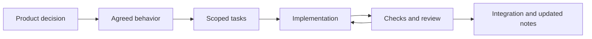

# Building Pet Easy with agents and skills

Pet Easy is an AI-assisted development project directed by **Tilemachos Tragakis**. I define the product, choose its technology direction, review the interface and guide iterations. Codex contributes implementation, research, tests and documentation. This portfolio represents that collaboration; it does not imply that every line was handwritten.

Written decisions, scoped tasks and observable checks keep the work connected to the product. Reusable skills give agents the relevant context and workflow for a particular responsibility.

## Scoped skills

| Area | Responsibility |
|---|---|
| Product, UX and UI | Outcomes, scope, journeys, visual direction and interaction review |
| Architecture | Shared behavior and technical tradeoffs |
| Django and PostgreSQL | Application behavior, permissions, data changes and persistence |
| React and Kotlin | Browser and native Android implementation |
| Docker | Reproducible application builds and local environments |
| Verification | Cross-client journeys, regressions and evidence boundaries |

These ten project skills are reusable workflows, not a permanent ten-agent team. A task selects the relevant ones. Parallel work has explicit ownership, and shared changes are reviewed together before integration.

## From a decision to a checked result

Durable notes distinguish owner decisions, engineering choices and proposals. This helps a later session continue the work without turning an old suggestion into a requirement. Reviews look for failures a user could encounter, compatibility problems and claims unsupported by the available evidence.

## Example: timeline, next actions and guidance

The product evolved from separate pet lanes into one shared date axis, then added **Next actions** for planned and overdue care. That decision required more than a new layout:

1. Define how filters, event groups, completion and selected dates work together.
2. Implement the agreed behavior in React and native Compose, with layouts appropriate to each platform.
3. Keep existing records, permissions, calendars and reminder behavior intact.
4. Exercise narrow screens, dense histories, view-only access, edited drafts and interrupted saves.
5. Add optional first-use guidance that advances after a successful save and can be skipped or replayed.

The later light/Graphite work followed the same pattern: review a visual direction, apply shared conventions, then check real screens and state preservation. Screenshots show the result; application tests and selected device journeys supply different evidence.

## What this demonstrates

The project demonstrates product direction, scoped delegation, iterative interface review and continuity across a growing application. It also makes the limits visible: a passing build is not device acceptance, and an attractive fixture is not proof of a complete user journey.

Public materials include the interface, broad engineering decisions, verification summaries and a [runnable recurrence example](https://github.com/RagDel/completion-recurrence). Implementation source, internal instructions, user records and operational setup remain private.

[Product walkthrough](WALKTHROUGH.md) · [Architecture](ARCHITECTURE.md) · [Verification](VERIFICATION.md)
