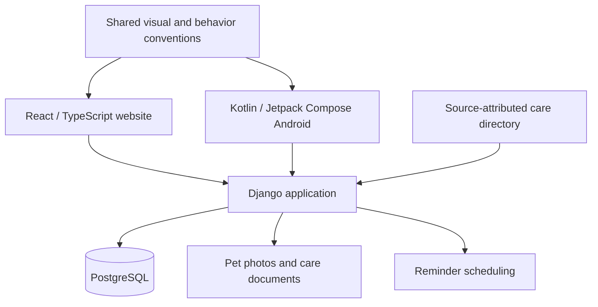

# Architecture and engineering decisions

Pet Easy brings a React website and a native Kotlin Android app together around the same pet-care records. The main engineering concern is consistent dates, permissions and edits across clients, while keeping each interface suited to its platform.

The diagram shows broad responsibilities. Managed cloud deployment and a public release remain upcoming milestones.

## Shared records, platform-specific presentation

React and Compose implement their own navigation, forms and interactions. Shared conventions keep pet accents, light/Graphite colors, event categories and calendar behavior aligned. Greek and English interfaces use the same care records.

The current experience pairs a shared timeline with **Next actions**, a list of planned and overdue care. Pet and category filters affect both views. Events remain anchored to their dates; overlapping markers form expandable groups. Day, Week, Month and Year views, a Today shortcut and reversible enlargement support short-term planning and longer histories. The browser opens enlarged; native Android retains its compact initial presentation.

## Product rules that survive a client change

Owners choose who can view or edit shared care. Those permissions apply to pets, events and documents across both clients. Concurrent edits and repeated submissions are handled explicitly so a retry does not silently create duplicate work or replace a newer change.

Repeats count from completion. Calendar intervals and reminder clocks follow the selected timezone rather than treating a month as a fixed number of days. Medical repeats require an owner-selected interval. The application can remember deliberately saved reminder choices for the same pet and type of care, while preserving edits already in progress.

The public [completion-recurrence Python sample](https://github.com/RagDel/completion-recurrence) makes one focused, date-only part of this work runnable.

## Discovery and useful context

The Greece care directory uses attributed OpenStreetMap and Overture records, with place lookup for city and area searches. It covers veterinary practices, groomers, shops and selected other care services. Distance ordering, map movement, category filters and explicit location requests support discovery. Reviewed duplicate grouping improves listings while retaining their source attribution; the directory is not a claim of complete or independently verified business coverage.

Optional introduction hints connect Add pet, Save event and the timeline. Contextual Help and replay remain available without forcing a returning user through onboarding. Theme changes preserve drafts and open controls; photos, saved pet gradients and map imagery retain their original appearance.

## Scope and next milestones

Account controls include export, session management and an account-deletion cancellation period. Pet-profile recovery is a separate product flow. These capabilities need continued operational and user acceptance work alongside the application itself.

Next milestones include managed hosting, wider physical-device and accessibility testing, release distribution and performance evaluation. Professional-care expansion, partner booking, subscriptions and iOS remain future scope.

[Verification and limits](VERIFICATION.md) · [Agent-assisted development](AGENT_WORKFLOW.md)
