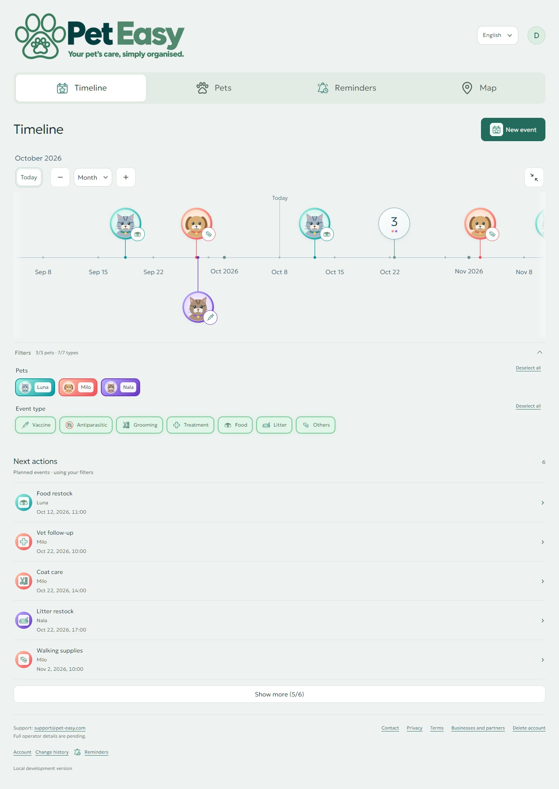
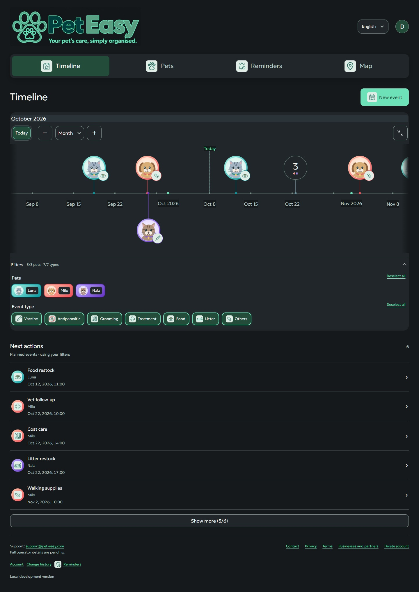
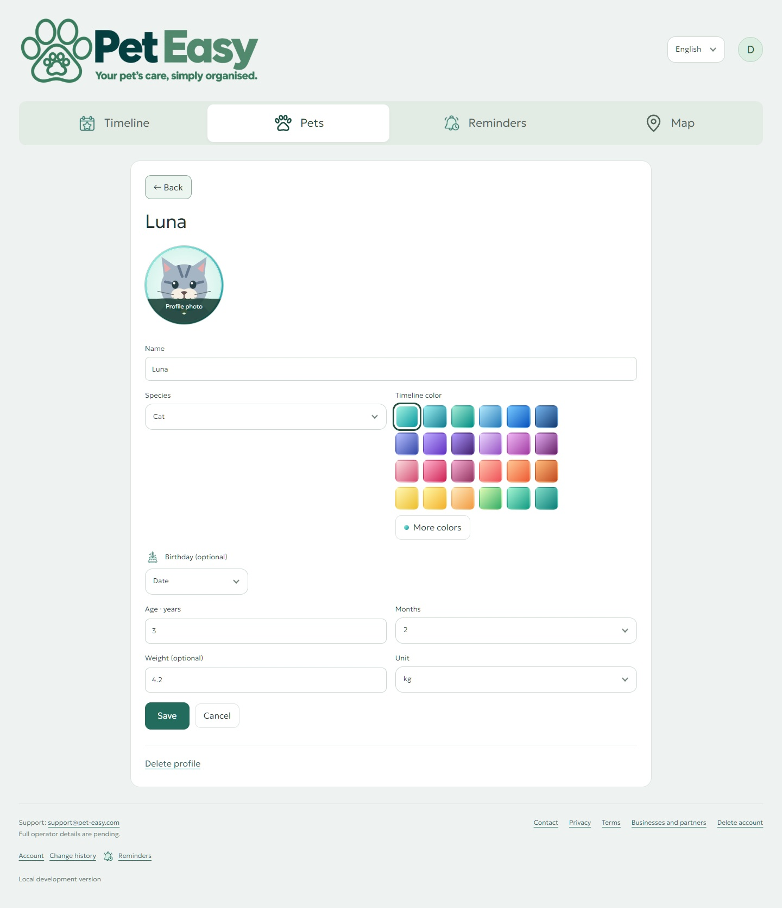
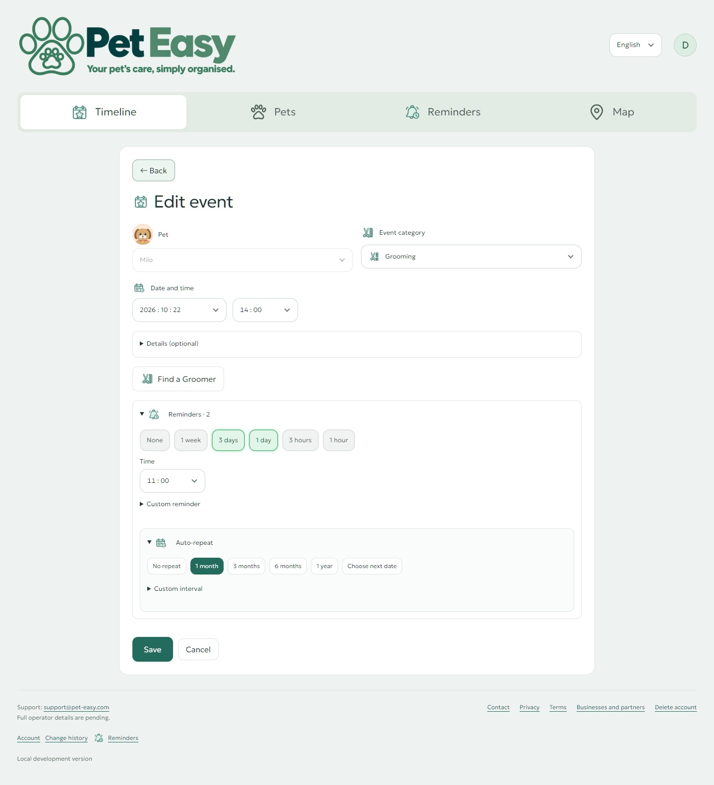
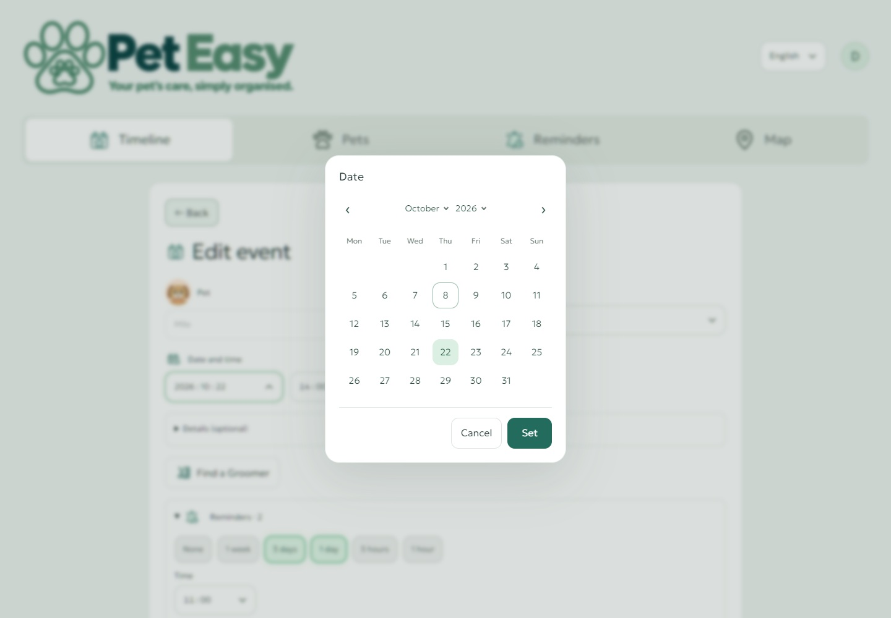
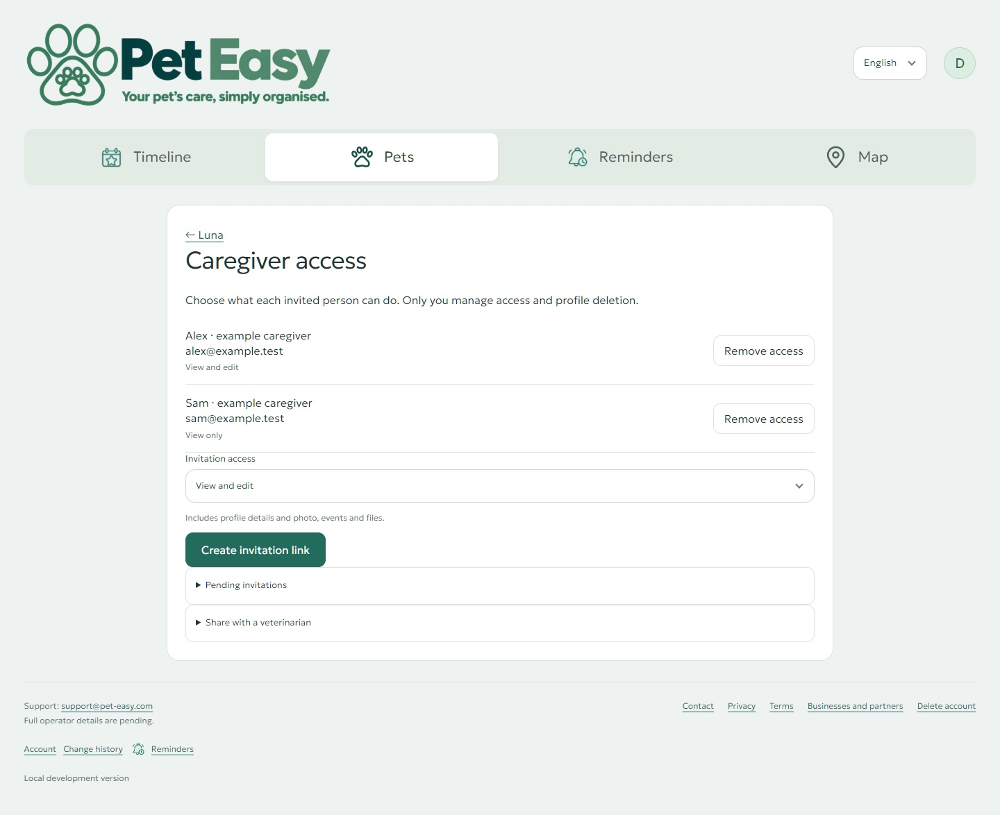
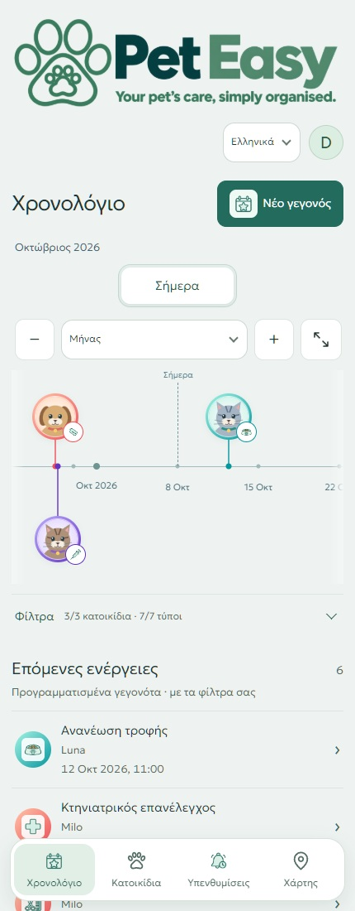
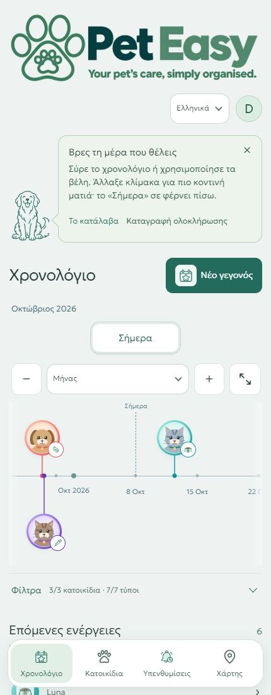

# Pet Easy: a visual walkthrough

Current interface preview · **8 October 2026**

These screenshots show the current React website with fictional pets, care events and caregiver accounts. The phone-width images show **responsive web**, not native Android. [Recorded application checks](VERIFICATION.md) are described separately.

## 1. Timeline + next actions

See selected pets on one date axis, then follow the next actions below. Pan through care history, open grouped events, filter pets or categories, and switch between Day, Week, Month and Year. The browser opens the timeline enlarged; it can be collapsed again.

## 2. A coordinated Graphite theme

Light and Graphite appearance carry through navigation, forms and dialogs. Pet photos and individual gradient colors stay recognizable in either theme.

## 3. Profiles with a personal identity

Keep a cropped photo, age or birthday, weight and a personal timeline color for each pet. Twenty-four gradient presets and custom colors help distinguish pets at a glance.

## 4. Care planning and reminders

Add notes, documents and provider details to an event. Choose reminder preferences and an optional repeat that counts from completion. The example is fictional; medical schedules follow the owner's veterinary instructions. Delivery acceptance is described in the [verification summary](VERIFICATION.md).

## 5. Clear date selection

A month calendar handles dates; smooth time wheels handle the clock. Matching care can reuse deliberately saved reminder preferences for the same pet.

## 6. Shared care with clear permissions

Invite a caregiver with viewing or editing access. Owners manage sharing, caregivers can leave, and attributed history helps everyone follow changes.

## 7. Greek responsive web

The phone layout keeps Timeline, Pets, Reminders and Map within reach. This preview deliberately collapses the timeline to show more next actions. The native Android app follows the same product behavior with its own Compose interface.

## 8. Help when it is useful

Optional first-use guidance connects the first pet, saved event and timeline. Contextual Help remains available, and tips can be dismissed or replayed.

## Beyond these screens

Provider discovery offers nearby care, map/list results and place search. Documents, account controls, data export and shared history support the wider journey.

Explore the [technical overview](ARCHITECTURE.md), [development workflow](AGENT_WORKFLOW.md), or [runnable Python recurrence sample](https://github.com/RagDel/completion-recurrence). Managed cloud deployment and a broader public release are upcoming milestones.
